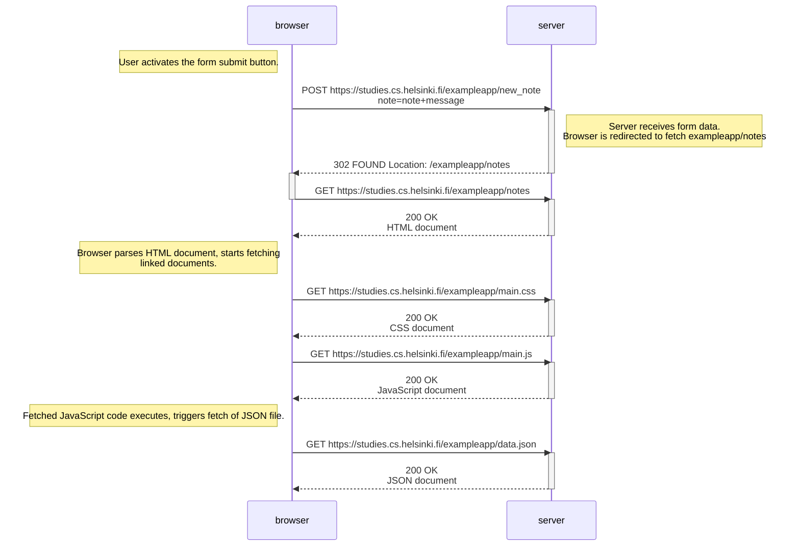

# Adding new note to exampleapp

```mermaid
sequenceDiagram
    participant browser
    participant server

    Note left of browser: User activates the form submit button.
    browser->>server: POST https://studies.cs.helsinki.fi/exampleapp/new_note <br/>note=note+message
    activate server
    Note right of server: Server receives form data.<br/>Browser is redirected to fetch exampleapp/notes
    server-->>browser: 302 FOUND Location: /exampleapp/notes
    deactivate server
    activate browser
    browser->>server: GET https://studies.cs.helsinki.fi/exampleapp/notes
    deactivate browser
    activate server
    server-->>browser: 200 OK <br/>HTML document
    deactivate server
    
    Note left of browser: Browser parses HTML document, starts fetching<br/>linked documents.
    browser->>server: GET https://studies.cs.helsinki.fi/exampleapp/main.css
    activate server
    server-->>browser: 200 OK <br/>CSS document
    deactivate server

    browser->>server: GET https://studies.cs.helsinki.fi/exampleapp/main.js
    activate server
    server-->>browser: 200 OK <br/>JavaScript document
    deactivate server

    Note left of browser: Fetched JavaScript code executes, triggers fetch of JSON file.
    browser->>server: GET https://studies.cs.helsinki.fi/exampleapp/data.json
    activate server
    server-->>browser: 200 OK <br/>JSON document
    deactivate server

```
