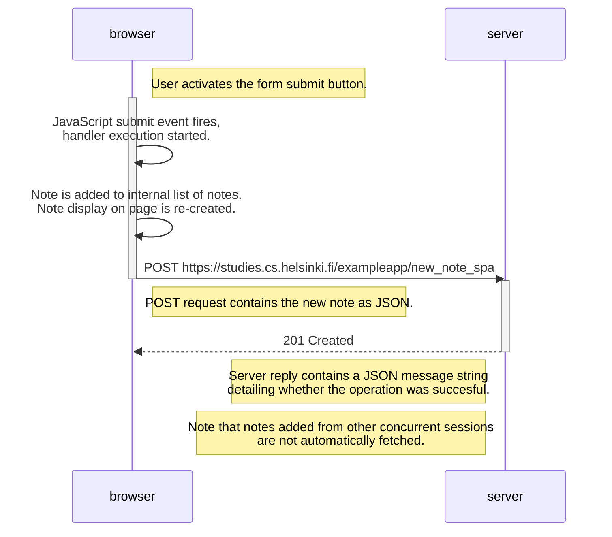

# Adding a new note with SPA exampleapp

```mermaid
sequenceDiagram
    participant browser
    participant server

    Note right of browser: User activates the form submit button.
    activate browser
    browser->>browser: JavaScript submit event fires, <br/>handler execution started.
    browser->>browser: Note is added to internal list of notes.<br/>Note display on page is re-created.
    browser->>server: POST https://studies.cs.helsinki.fi/exampleapp/new_note_spa
    deactivate browser
    activate server
    Note right of browser: POST request contains the new note as JSON.
    server-->>browser: 201 Created
    deactivate server
    Note left of server: Server reply contains a JSON message string<br/>detailing whether the operation was succesful.
    Note left of server: Note that notes added from other concurrent sessions<br/> are not automatically fetched.
```
